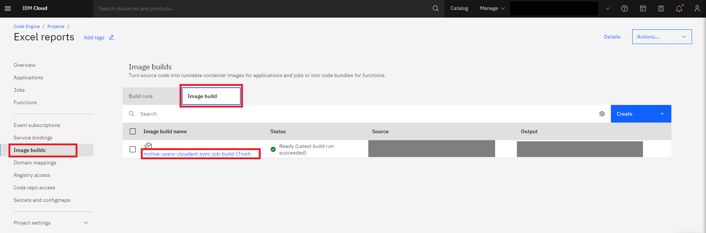

+++
title = 'IBM Cloud Code Engine'
date = 2023-11-21T14:06:39-05:00
draft = false
summary = 'IBM Cloud Code Engine - tutorial on how to run Javascript jobs using cron event producer'
+++

# IBM Cloud Code Engine - run Javascript jobs using cron event producer

## What is Code Engine?
> IBM Cloud Code Engine (CE) is a fully managed serverless platform designed to simplify and accelerate the deployment of containerized applications. 
> 
> It enables developers to focus on writing code without the burden of managing the underlying infrastructure. Code Engine abstracts away the complexities of container orchestration, auto-scaling, and server provisioning, allowing users to effortlessly deploy applications in a serverless fashion. 
> 
> With its seamless integration with popular container orchestration tools like Kubernetes, Code Engine offers flexibility and scalability, making it an ideal choice for both beginners and experienced developers. 
> 
> Whether deploying microservices, APIs, or batch jobs, Code Engine streamlines the development process, enabling rapid innovation and reducing time-to-market for applications. Its pay-as-you-go pricing model ensures cost-effectiveness, making it an attractive solution for businesses looking to optimize their cloud infrastructure.

## What are Code Engine Jobs?
> In IBM Cloud Code Engine, Jobs are a key concept for running batch workloads or one-time tasks without the need for continuous application execution. Jobs allow developers to execute containerized workloads at scale, efficiently handling tasks such as data processing, data analysis, or periodic batch jobs. 
> 
> Users can define the desired resources, such as CPU and memory, and Code Engine takes care of dynamically provisioning the required infrastructure. With Jobs, developers can leverage the serverless paradigm to execute tasks without worrying about the underlying infrastructure, enabling efficient resource utilization and seamless scalability for batch processing in the cloud.

## What are Code Engine Events?
> In IBM Cloud Code Engine, Events are a powerful mechanism for triggering and automating the execution of serverless functions or applications. Code Engine Events enable developers to respond to various external stimuli, such as changes in data, incoming messages, or scheduled time intervals. 
> 
> By defining event sources, such as message queues, object storage changes, or HTTP requests, users can seamlessly connect their applications to external triggers. This event-driven architecture allows for the automatic scaling and execution of code in response to specific conditions, providing a flexible and dynamic way to build reactive and responsive cloud applications. 
> 
> Code Engine Events enhance the serverless experience by enabling developers to create workflows that respond to real-time events, enhancing the agility and responsiveness of cloud-native applications.

## In the tutorial below, we will create the following:

1. Code Engine project
2. Javascript function
3. Code Engine Job
4. Code Engine Event
5. Code Engine Build

## _Pre-requisites_
1. Terminal basic knowledge
2. [IMB Cloud account](https://cloud.ibm.com/login)
3. [IBM Cloud CLI](https://cloud.ibm.com/docs/cli?topic=cli-getting-started) in your terminal
4. [Node and npm](https://nodejs.org/en/download) installed in your terminal

## 1. Login to IBM Cloud and install CE CLI
1. Login to IBM Cloud.

    Basic:
    ```
    ibmcloud login
    ```
    Example with one-time passcode
    ```
    ibmcloud login -a https://cloud.ibm.com -u passcode -p <one-time passcode>
    ```
2. Target the resource group
    ```
    ibmcloud target -g <resource_group>
    ```
3. Install code engine plugin. More info - [Code Engine CLI](https://cloud.ibm.com/docs/codeengine?topic=codeengine-install-cli). 
    ```
    ibmcloud plugin install code-engine
    ```
4. Check if it was installed
    ```
    ibmcloud plugin list
    ```
    Output example:
    ```
    Plugin Name	 Version	Status
    code-engine/ce	 1.36.0
    ```
## 2. Create a project
Source - [Managing projects](https://cloud.ibm.com/docs/codeengine?topic=codeengine-manage-project)

> A project is a grouping of Code Engine entities such as applications, jobs, and builds. A project is based on a Kubernetes namespace. The name of your project must be unique within your IBM Cloud® resource group, user account, and region. Projects are used to manage resources and provide access to its entities.

1. Go to Code Engine -> [Projects](https://cloud.ibm.com/codeengine/projects) and click `Create` button.
2. Choose a location to deploy the project.
3. Enter a name for the project. The name must be unique for all your projects within the specified location.
4. Choose the resource group where you want to create the project.
5. Click `Create`.

    > Creating a project with the CLI.
    > When you create a project, it is automatically selected as the current context. To create a project that is not automatically selected, use the `--no-select` option.

6. Create a project with the [**`project create`**](https://cloud.ibm.com/docs/codeengine?topic=codeengine-cli#cli-project-create) command. Use a project name that is unique to your region.
    ```
    ibmcloud ce project create --name <PROJECT NAME>
    ```

7. Verify that your new project is created with the [**`project get`**](https://cloud.ibm.com/docs/codeengine?topic=codeengine-cli#cli-project-get) command.
    ```
    ibmcloud ce project get --name <PROJECT NAME>
    ```

    > You can also list all projects and this output displays which project is your selected project. In the following example, `myproject` is the project that is selected as the current context.

    ```
    ibmcloud ce project list
    ```

8. Select available project by its ID
    ```
    ibmcloud ce project select -id <project ID>
    ```
9. Check if the project is currently selected
    ```
    ibmcloud ce project current
    ```
    Output example:
    ```
    Name:       Excel reports
    ID:         <ID>
    Subdomain:  <Subdomain>
    Domain:     us-east.codeengine.appdomain.cloud
    Region:     us-east

    Kubernetes Config:
    Context:               198d99fbpz8o
    Environment Variable:  SET "KUBECONFIG=~/.bluemix/plugins/code-engine/Excel reports-4835ea34-5a19-4789-9ab0-da35bbc92f39.yaml"
    ```

## 3. Create a Javascript function
> We will need a runnable code that will be triggered by the Job. This function will be stored on Github and Dockerized into container image stored in an image repository of IBM Cloud.

1. Open your code editor, create new project directory, and create a node application with:
    ```
    npm init
    ```
2. Create an `index.js` and add your code. For example:
    ```
    function main() {
          let msg = 'You did not tell me who you are.';
          if (process.env.API_KEY) {
              msg = `Hello, ${process.env.API_KEY}!`
          } else {
              msg = `Hello, Functions on CodeEngine!`
          }
          return {
              headers: { 'Content-Type': 'text/html; charset=utf-8' },
              body: `<html><body><h3>${msg}</h3></body></html>`
          }
      }
      
      main();
    ``` 
3. Add any environment variables to your project. In the above code we are using `process.env.API_KEY` therefore `API_KEY` has to be added into a Config Map as env. variable.

    
    
    

4. Add key value pairs and click `Create` button.
5. Add newly created config map to your job. Go to Job -> Configuration tab -> Environment variables.

    

    > No need to adding prefix when your env. variables already are prefixed. Otherwise, please add a prefix. Click `Add`.

    > Remember to click "Save" before leaving this page!

    > You can also create a config map using your CLI.
    >
    > [How to create a config map](https://cloud.ibm.com/docs/codeengine?topic=codeengine-configmap#configmap-create)
    >
    > [Reference config map in your code](https://cloud.ibm.com/docs/codeengine?topic=codeengine-configmap#configmap-ref)

6. Create `Dockerfile` in the root of your function project. Here's an example of a node.js Dockerfile
    ```
    FROM node:20-alpine

    COPY index.js /app/index.js
    COPY package.json .
    WORKDIR /app
    RUN npm install

    ENTRYPOINT ["node", "index.js"]
    ```

7. A good practice is to add a `.dockerignore` and `.ceignore` alongside of `.gitignore`. 
8. Also, at this point it's highly recommended to read documentation on [Configuring project-wide settings](https://cloud.ibm.com/docs/codeengine?topic=codeengine-project-integrations#projectintegration-cr)
9. When you're ready with the above, you can push your code to a **Private or Public** repo on Github. For this tutorial, we will use the Github repo as a source for the Container Image build.

## 4. Create a job
Source - [Working with jobs and job runs](https://cloud.ibm.com/docs/codeengine?topic=codeengine-job-plan)

Definition of a Job on IBM Cloud Code Engine:
> A job runs one or more instances of your executable code. Unlike applications, which handle HTTP requests, jobs are designed to run one time and exit. When you create a job, you can specify workload configuration information that is used each time that the job is run.

There are three sources for a job:
- container image
- source code that is located in a Git repository
- source code on a local workstation

> This tutorial will show you how to create a job based on source code that is located in a Git repository.

1. Go to your project at IBM Cloud Code Engine and click `Create` button on the top, right corner. Select `Source Code` to build container image from source code.

    

2. Select resources that will be consumed every time a job runs. It's good to keep it small as this job won't require significant CPU/RAM and Storage. Keep the rest of the settings as default.

    

3. Click on the `Specify build details` button. A Sidebar will open with container image build settings. Select a source repository - it should be the repository location where you pushed your function in the previous step. You can optionally provide a branch name. If you do not provide a branch name and you leave the field empty, Code Engine automatically uses the default branch of the specified repository. Click `Next`.
4. On the next screen, select `Dockerfile` as an option and select your preferred build resources. Leave `Dockerfile` input field as is. Click `Next`.

    

5. On the `Output` screen, select `private.icr.io` as your default Registry Server, leave Registry access secret as is, select a Namespace and provide an image name. Set Tag to `latest`. This way, your image will always end up with the `latest` version. If your registry is private, you must [set up access](https://cloud.ibm.com/docs/codeengine?topic=codeengine-add-registry) to it.
6. Select an existing **Registry access secret** or create a new one. If you are building your image to an IBM Cloud Container Registry instance that is in your account, you can select `Code Engine managed secret` and let Code Engine create and manage the secret for you.
7. Select a namespace, name, and a tag for your image. If you are building your image to an IBM Cloud Container Registry instance that is in your account, you can select an existing namespace or let Code Engine create and manage the namespace for you.
8. Click **Done**.
9. Now you should see a summary and you should remember to click `Save` above.

    

    > You can also create a job using the terminal CLI like so:

    ```
    ibmcloud ce job create --name myjob-repo --build-source https://github.com/<YOUR REPO>
    ```

    > You can read more about this CLI command [here](https://cloud.ibm.com/docs/codeengine?topic=codeengine-cli#cli-job-create).

10. The first Image build will run and it should come back as successful. You will know by looking at the `Build run status`.

    

11. From this moment, whenever you change something in your code, you should push the changes to Github and then you should build the container image again. You can do it by using a CLI command in your terminal.
    ```
    ibmcloud ce buildrun submit --build <Build Name>
    ```

    The Build Name can be acquired by visiting the `Image Builds` section.
    

    > Remember! Every time you're building a new image, you're overwriting the previous container image. It is because we're overwriting the `latest` image version.

12. When your images are up-to-date and successfully built, you can run a job again. Triggering a job can happen either from the UI or the terminal. 

    - Terminal:
        ```
        ibmcloud ce jobrun submit --name <UNIQUE JOB NAME> --instances 1
        ```

    - UI:

      Click `Submit Job` from the Job section's top right corner. In the Sidebar, leave instances set to 1 and click `Submit job`.
      

13. You can check the Job run status by running:
    ```
    ibmcloud ce jobrun get -n <UNIQUE JOB NAME>
    ```

14. Also, you can check the logs from the job run:
    ```
    ibmcloud ce jobrun logs -f -n <UNIQUE JOB NAME>
    ```

## 5. Create Event subscriptions - cron
Source - [Getting started with subscriptions](https://cloud.ibm.com/docs/codeengine?topic=codeengine-subscribing-events)
1. Create Event subscriptions (Create event subscriptions to send events to your application or job consumers.) - click `Create` button.
    ![[Code_engine_cron1.png]](../../images/../static/images/Code_engine_cron1.png)
    ![[Code_engine_cron2.png]](../../images/../static/images/Code_engine_cron2.png)

2.  Select Periodic timer and name the subscription event. Click `Next`.
    ![[Code_engine_cron3.png]](../../images/../static/images/Code_engine_cron3.png)
3. Set a cron schedule and click `Next`. If you need more information, you can find it here - [Working with the Periodic timer (cron) event producer](https://cloud.ibm.com/docs/codeengine?topic=codeengine-subscribe-cron)
    ![[Code_engine_cron4.png]](../../images/../static/images/Code_engine_cron4.png)
4. Click `Next` on the next screen.
5. Select a component that will receive events - the job. Click `Next`.
    ![[Code_engine_cron5.png]](../../images/../static/images/Code_engine_cron5.png)
6. View the summary page and Click `Create`.
    ![[Code_engine_cron6.png]](../../images/../static/images/Code_engine_cron6.png)

    > There's a way to create an event subscription using the CLI:

    For example, to create a cron subscription that sends an event to a job every 5 minutes:
    ```
    ibmcloud ce sub cron create --name <EVENT NAME> --destination-type job --destination <JOB NAME> --schedule '*/5 * * * *'
    ```

    > [More information about this CLI command](https://cloud.ibm.com/docs/codeengine?topic=codeengine-cli#cli-subscription-cron-create)

## 6. Create a build and run build
Source - [Planning your build](https://cloud.ibm.com/docs/codeengine?topic=codeengine-plan-build)

> A build, or image build, is a mechanism that you can use to create a container image from your source code. Code Engine supports building from a Dockerfile and Cloud Native Buildpacks.

1. Go to `Projects -> Image Builds` and click Tab `Image build`. Click `Create` button.
2. Specify build details by targeting your code repo on Github. If your repo is Private, then `Create Code Repo Access`.  If you're using a Public repo, skip the next steps until step 6.
3. For Private repos, you will need to access them using an SSH URL instead of an HTTP or HTTPS URL. An example of an SSH URL is 'git@github.com:IBM/CodeEngine.git'.
4. For Private repos, you will also need the Code repo access. If you can't see any options in the dropdown, it means that you need to create it first on a different page. Go to main Overview of the Project and on the left sidebar, click `Code repo access`. Then, click `Create` button in the top right corner. A new sidebar opens on the right. Enter the name.
5. For the SSH private key, you will need to copy it from your local machine's `~/.ssh/...` (ex. `cat ~/.ssh/id_ed25519`) and paste it in here. If you don't have one created yet for your Github account, please visit [Generating A New SSH Key](https://docs.github.com/en/authentication/connecting-to-github-with-ssh/generating-a-new-ssh-key-and-adding-it-to-the-ssh-agent) and follow the steps.
    

    > You can also update your Git Repo Secret using the CLI like so:

    ```
    ibmcloud ce build update --name <name-of-your-buld> --git-repo-secret <name-of-your-secret>
    ```

    > To check if it updated successfully:

    ```
    ibmcloud ce build get --name <name-of-your-buld>
    ```

6. Choose the branch which usually is `main` but maybe you want to build another branch. You can also specify the Context directory because your function and Dockerfile are stored in a directory and not the root of the repo.
7. On the next screen I advise you to leave defaults although you may want to use a different Build resources configuration. I recommend starting from the smallest.
8. On the last screen, choose Registry Server. If you're in the US, I recommend `private.us.icr.io` for the IBM default registry. Your registry can be also the Docker registry. If you have the Registry access secret, please specify. If not, leave the default as `Code Engine managed secret`. Select Namespace or type in your own. Name the Image and tag the builds. I recommend the `latest` for the Tag. Click `Done`.
9. Click your build configuration from the list. From this screen, you can click on `Submit build` which will build your image and save it into the registry.
    

    > Now, every time you need a new build, you can use your CLI in the terminal like so:

    ```
    ibmcloud ce buildrun submit --build <Build name>
    ```

    > If you're not sure what the build name is, you can get a list of available build names like so:

    ```
    ibmcloud ce build list
    ```
